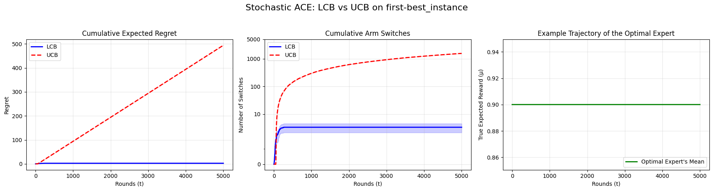
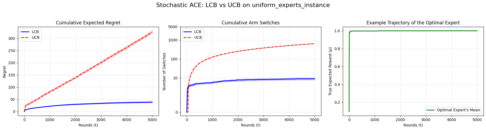
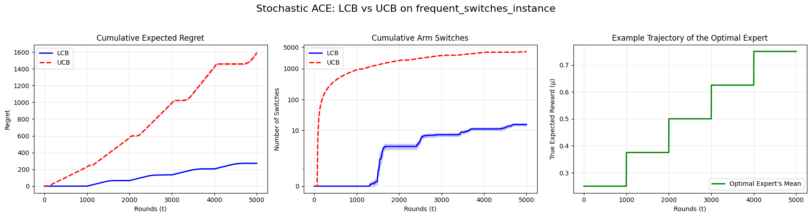

# Regret Minimization With a Crowd of Awakening Experts

This repository contains the official code and experimental results for the paper **Regret Minimization With a Crowd of Awakening Experts**, currently under review. 

In standard online learning, the set of experts is fixed. In the ACE setting, **new experts continuously "awaken" (arrive) over time**. We prove both theoretically and empirically that standard optimism-in-the-face-of-uncertainty (e.g., UCB) catastrophically fails in this environment due to perpetual over-exploration. To solve this, we introduce a novel pessimistic algorithm, $\pi_{LCB}$, which achieves sublinear regret by demanding strict statistical confidence before abandoning proven experts.

## Key Findings
1. **Optimism Fails:** A standard UCB ($\pi_{UCB}$) algorithm suffer linear regret $\Omega(T)$ because they are endlessly distracted by newly arriving experts (even precluding it from choosing an expert in the same round as it arrived).
2. **Pessimism Succeeds:** Lower Confidence Bound ($\pi_{LCB}$) algorithm achieves $\tilde{\mathcal{O}}(\sqrt{\Upsilon^* T})$ regret, where $\Upsilon^*$ is the number of times the true optimal expert switches.
3. **Simulated Data:** We test the two approaches on simulated data, across different types of instances. LCB shows its superiority especially in nearly-stationary instances, that easily trick UCB.
4. **Real-World Viability:** On 6 years of historical financial data across 12 diverse market assets, $\pi_{LCB}$ drastically reduced unnecessary switching by over 95% compared to UCB, resulting in highly stable and profitable regime tracking.

---

## 📊 Real-World Application: Expanding Momentum Ensembles

To demonstrate the practical efficacy of $\pi_{LCB}$, we applied it to financial time-series forecasting. We formulated an expanding ensemble of momentum-based trading rules, where an expert requiring an $i$-day lookback window deterministically "awakens" on day $i$. 

The table below shows the performance over $T=1500$ trading days (approx. 2018–2024). Standard UCB switches almost every single day, while our LCB agent successfully tracks market regimes with minimal switching costs.

### Table 1: Real-World Performance on Expanding Momentum Ensembles (T=1500)

| Asset | $\pi_{LCB}$ Regret | $\pi_{UCB}$ Regret | True OPT Switches ($\Upsilon^*$) | $\pi_{LCB}$ Switches | $\pi_{UCB}$ Switches |
| :--- | :--- | :--- | :--- | :--- | :--- |
| **S&P 500 (Large Cap Blend)** | 19.60 | 373.85 | 7 | **58** | 937 |
| **NASDAQ (Tech-Heavy Index)** | 22.39 | 378.23 | 5 | **77** | 990 |
| **Russell 2000 (Small Cap Volatility)** | 17.44 | 368.23 | 7 | **88** | 761 |
| **Apple (Consumer Tech)** | 19.18 | 370.60 | 7 | **38** | 981 |
| **Nvidia (High Growth/Semiconductors)** | 25.11 | 349.17 | 3 | **43** | 925 |
| **JPMorgan Chase (Banking)** | 4.89 | 376.11 | 2 | **24** | 827 |
| **Caterpillar (Industrials/Macro)** | 11.45 | 358.36 | 1 | **41** | 846 |
| **Johnson & Johnson (Healthcare)** | 22.36 | 367.86 | 0 | **115** | 792 |
| **Walmart (Consumer Staples)** | 16.65 | 340.04 | 3 | **85** | 936 |
| **ExxonMobil (Energy)** | 13.17 | 364.34 | 2 | **45** | 855 |
| **SPDR Gold Trust (Safe Haven Asset)** | 7.63 | 372.80 | 13 | **22** | 968 |
| **Bitcoin (Crypto/High Variance)** | 11.18 | 366.49 | 6 | **39** | 920 |

> **Note on Reproducibility:** You can reproduce these exact results by running `python run_reproducible_campaign.py`. Assets are configured in `tickers.yml`.

---

## 📈 Simulated Scenarios (Stochastic ACE)

We tested the algorithms in controlled stochastic environments to validate our theoretical bounds.

### 1. First-Best Instance
In this instance, the first expert to appear is also the best ($\mu_1 = 0.9$), and the others are all equal and slightly worse ($\mu_j = 0.8~~\forall j \ge 2$). An optimistic policy struggles in this type of instances: exploring always results in incurred regret. We simulate the environment $20$ times, setting $T=5000$.

| Metric | $\pi_{LCB}$ | $\pi_{UCB}$ (Baseline) |
| :--- | :--- | :--- |
| **Final Cumulative Regret** | 2.59 ± 1.11 | 494.12 ± 0.11 |
| **Total Arm Switches** | 3.35 ± 1.20 | 1553.15 ± 6.87 |
| **Total Optimal Pulls** | 4974.05 ± 11.07 | 58.85 ± 1.10 |

### 2. Uniform Experts
In this instance, the expert appearing at time $t$ has its average reward $\mu_t$ sampled from a uniform distribution in $[0.1,0.9]$. An optimistic policy struggles in this type of instances: exploring always results in incurred regret. We simulate the environment $20$ times, setting $T=5000$.

| Metric | $\pi_{LCB}$ | $\pi_{UCB}$ (Baseline) |
| :--- | :--- | :--- |
| **Final Cumulative Regret** | 38.50 ± 3.04 | 325.89 ± 4.85 |
| **Total Arm Switches** | 8.95 ± 1.18 | 640.70 ± 4.41 |
| **Total Optimal Pulls** | 320.35 ± 132.34 | 69.20 ± 8.66 |

### 3. Frequent Switches Instance
In this instance, we mimic the lower bound construction by defining a large number of epochs ($T^{1/3}$) and letting the optimum increase by the minimum possible amount at every epoch. LCB still outperforms UCB.

| Metric | $\pi_{LCB}$ (Proposed) | $\pi_{UCB}$ (Baseline) |
| :--- | :--- | :--- |
| **Final Cumulative Regret** | 422.36 ± 4.84 | 856.19 ± 11.39 |
| **Total Arm Switches** | 62.35 ± 5.99 | 2172.05 ± 21.81 |
| **Total Optimal Pulls** | 294.00 ± 0.00 | 2639.40 ± 16.06 |

